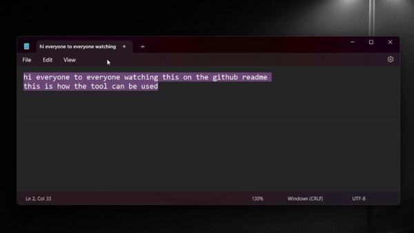
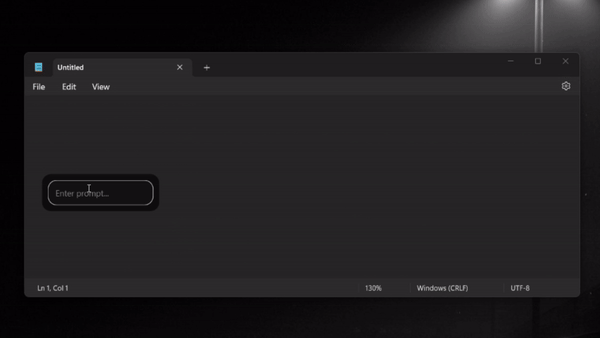

<div align="center">
  
  <p>A Python-based autocorrect tool that generates or modifies text in any input field & more</p>
  <p>
    <a href="https://github.com/max1mde/FIX/stargazers">
      
    </a>
    <a href="https://github.com/max1mde/FIX/forks">
      
    </a>
    <a href="https://github.com/max1mde/FIX/issues">
      
    </a>
    <a href="https://github.com/max1mde/FIX/contributors">
      
    </a>
    <a href="https://github.com/max1mde/FIX/releases">
      
    </a>
  </p>
</div>

## Features
- AI - **Command Execution Prompt (Ctrl+F7)**: Perform almost any action in windows like "open recycle bin" using a text box (multi steps support)
- **Fix Text (Ctrl+F8)**: Automatically corrects capitalization and punctuation
- AI - **Rephrase (Ctrl+F9)**: AI-powered text rephrasing with multiple suggestions (first suggestion does not rephras the text just "fixes" the text)
- AI - **Switch Suggestions (Ctrl+F10)**: Cycle through different rephrasing options (by default 3)
- AI - **Translate (Ctrl+F11)**: Automatic translation between English and German (Or any other language)
- AI - **Custom Prompt (Ctrl+F12)**: Open a popup for custom AI text operations with some presets

> [!IMPORTANT]  
> For all AI features, an open router API key is needed.

## Demo




## Installation

### Option 1: Download Release
1. Download `Autocorrect.exe` from the [latest release](https://github.com/max1mde/FIX/releases/latest)
2. Run `Autocorrect.exe`

### Option 2: Build from Source
1. Clone the repository:
```bash
git clone https://github.com/max1mde/FIX.git
```

2. Create a virtual environment:
```bash
python -m venv venv
source venv/Scripts/activate
```

3. Install requirements:
```bash
pip install -r requirements.txt
```

## Setup

1. Create an API key at [OpenRouter](https://openrouter.ai/)
2. Launch the app and enter your API key in settings
3. Press `Save Settings` to apply the API key
4. Configure hotkeys and preferences as needed

## Usage Guide

### Basic Operations
- When "Auto Select Text" is enabled:
  - Pressing a hotkey will automatically select all text in the current field
  - The selected text will be processed according to the hotkey function
  - Modified text automatically replaces the original

- When "Auto Select Text" is disabled:
  - Manually select the text you want to modify
  - Press the appropriate hotkey

### Hotkeys (Default settings)
1. **Command Execution Prompt (Ctrl+F7)**
   - Opens popup with preset operations (for example: Open device manager)
   - Allows custom AI instructions
Example prompt:
`open chrome 3 times, open spotify and skip song, open rick roll on youtube, close browser`


1. **Fix Text (Ctrl+F8)**
   - Adds capitalization, and punctuation
   - Applies custom replacement rules
   - Perfect for quick text cleanup

2. **Rephrase (Ctrl+F9)** AI
   - Generates multiple AI-powered rephrasing options (3 by default)
   - Use Ctrl+F10 to cycle through suggestions
   - Maintains original meaning while improving clarity

3. **Translate (Ctrl+F11)** AI
   - Automatically detects language
   - Translates between English and an alternate language (default is German)
   - Preserves formatting and tone

4. **Custom Prompt (Ctrl+F12)** AI
   - Opens popup with preset operations (when text is marked; otherwise, just an input field)
   - Allows custom AI instructions
   - Quick access to common text transformations

### System Tray
- App minimizes to system tray for easy access
- Right-click tray icon for quick settings access

## Requirements
- Windows 10/11
- Python 3.10+ (for building from source)
- Internet connection for AI features
- Account on https://openrouter.ai/ with credits

## Building Executable
```bash
pip install pyinstaller
pyinstaller main.spec
```
The executable will be created in the `dist` folder.

## Configuration
Settings are stored in `%APPDATA%/Autocorrect/settings.json`
